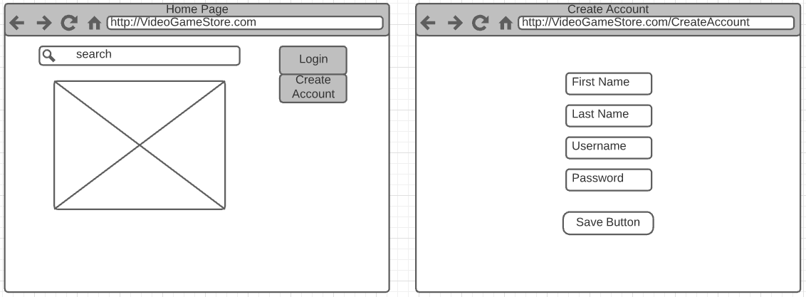
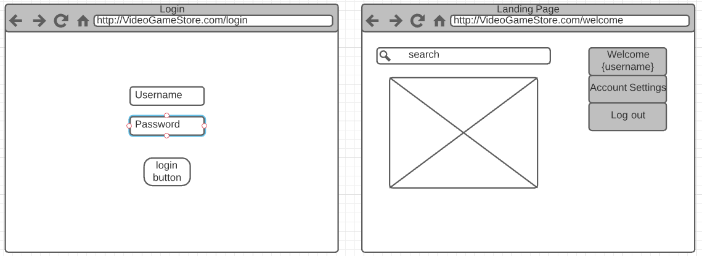
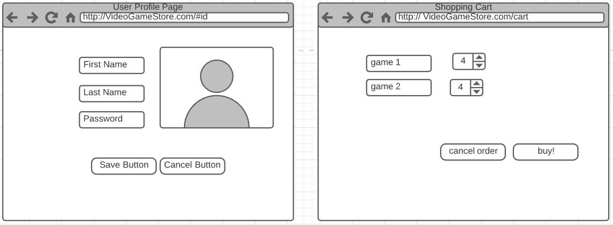
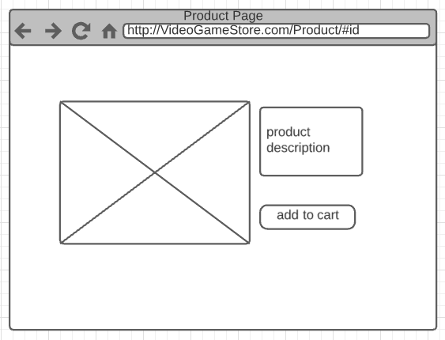

# Video Game Selling Site

> The information below includes items from the project prompt
## Motivation
Use the agile process to research, develop, deploy, and present a full stack webstore.  This is intended to give students the experience of designing and deploying a website while researching and learning new information. In addition,it gives students an opportunity to develop proficiency with the technology of their choicewhich will hopefully instill a sense of pride and accomplishment... wait...

## Project Description
For this project teams of 3-4 students will design and implement a webstore using modern web frameworks. This will require the development of a Representational state transfer(REST) Application Programming Interface (API), a constant integration, constant development (CICD) pipeline, and a persistence layer. The website should be deployed to a Platform as a Service (PaaS) such as Herokuor Google App Engine. 

## Project Board
[Web Store Project Board](https://github.com/users/dignacio0815/projects/1)

## You will be graded on the following:

**Activities Required**
- [ ] Research libraries/frameworks
    - Elixir
       - [Phoenix](https://www.phoenixframework.org/)
    - Java
        - [spring-boot:](https://spring.io)(back end REST)
    - JavaScript
        - [express.js:](https://expressjs.com/)(back end REST)
        - [Node](https://nodejs.org/)
        - [React](https://reactjs.org/)
        - [Vue.js](https://vuejs.org/)
    - PHP
        - [Laravel:](https://laravel.com/)(back end REST)
    - Python
        - [Django:](https://www.djangoproject.com/)(back end REST)
        - [Flask:](http://flask.palletsprojects.com/)(back end REST)
    - Ruby
        - [Ruby-on-rails](https://rubyonrails.org/)
    - Scala
        - [Play](https://www.playframework.com/)
    - TypeScript
        - [Angular](https://angularjs.org/)
        
- [ ] Research Database Technologies
    - MongoDB
    - MariaDB
    - MySQL
    - Postgres
    - SQLite
- [ ] Develop a wireframe of a website
- [ ] Develop users stories and rate them

***

**REST API**
- [ ] API must support the following
    - [ ] List all items
    - [ ] Add new items
    - [ ] Remove items
    - [ ] Update items
    - [ ] Search for items
    - [ ] Create new user account
    - [ ] User Log in
    - [ ] User log out
    - [ ] Add items to cart
    
***

**Web front end**
- [ ] Landing page
    - The page that shows what your store is about
- [ ] Product page
    - A listing of the products
    - Show pictures and brief descriptions. Check Amazon.com or etsy.com for inspiration
- [ ] A product detail page
    - The page that lists the descriptions and details of the product
- [ ] Shopping cart
    - The page that shows the user details of what they have selected.
    - Quantity, subtotal, etc.
    - The user must be able to make changes to their cart
- [ ] Create account page
    - We have all seen these. Ask for a usernameand password
    - Do not allow duplicate usernames
    - enforce simple password rules (minimum length >=6 characters, alphanumeric with at least one special character)
- [ ] Log in page
    - Standard username and password page
- [ ] User profile page
    - Show the username and relevant detail
***
**Persistence Layer**
- [ ] MariaDB
- [ ] MySQL
- [ ] Information to be stored in  the database:
    - User information
    - Product details
    - Shopping cart information
    
## Sprint 1 ()

**User Story**: Setting up database - Charlie Nguyen
> As a video game shopper, I want to be able to have my credentials, items for sale/bought saved so we could query it later

**Definition Of Done**:
- [ ]

Note: This would be used to store items that a user has purchased, put up for sale, and user credentials

***

## Sprint 2 ()

## Sprint 3 ()

**User Story**: Create Account - Cathy Hsu
>As a video game shopper I want to create an account so I can buy video games and keep track of my search history.

**Definition Of Done**:
- [ ] Ask for first name, last name, username, password
- [ ] Do not allow duplicate usernames 
- [ ] Enforce password rules: 
    - At least 6 characters with 1 special character

***

**User Story**: Login to the System - Denize Ignacio
> As a video game shopper I want to login so I can purchase games and view my history

**Definition Of Done**:
- [ ] Purchase/view new/old video games
- [ ] Have my history persist from previous times I’ve logged in

Note: This is necessary for the site since we want the users to be able to log back in with their data saved

***

**User Story**: Landing Page - Shawn Deppe
> As a video game shopper  I want to access the home screen  so I can see the what the store is selling

**Definition Of Done**:
- [ ] Should include search bar
- [ ] Should include categories

Note: This will allow the user to naviagte through the website

***

**User Story**: Search Functionality - Denize Ignacio
> As a video game shopper I want to search for other video game titles/consoles and filter by category

**Definition Of Done**:
- [ ]

Note: This is necessary for the site since we want users to search for other video game titles

***

**User Story**: User Profile Page - Charlie Nguyen
> As a video game shopper I want to be able to view my personal information in case I want to make any changes to it.

**Definition Of Done**:
- [ ] Display user information
    - first name
    - last name
    - username
    - password
- [ ] Stretch goal: Implement edit user
- [ ] Stretch goal: Give users option to upload profile pic

***

**User Story**: Shopping Cart - Shawn Deppe
>As a video game shopper  I want to have a shopping cart  so I can see the items I have selected

**Definition Of Done**:
- [ ] Display items user has selected 
- [ ] Should allow users to edit items in the cart

Note: This is necessary for the user to see what items they have selected

***

**User Story**: Product Page - Cathy Hsu
>As a video game shopper  I want to have a product page so I can see all the items I am interested in buying

**Definition Of Done**:
- [ ] Display all video games that meet the search criteria
- [ ] Clicking on a video game will bring the user to the individual product page

***

**User Story**: Edit Sell Item - Denize Ignacio
>As a video game seller I want to be able to edit item information later after I have put it up for sale. Anything from price, name, etc. I should be able to edit.

**Definition Of Done**:
- [ ]

## Mockups
>- To edit the mockups on Lucid Chart click [here](https://app.lucidchart.com/invitations/accept/72ffae0e-49dd-4de9-873d-e0dbb19fcf92)

## ERD Diagram:
